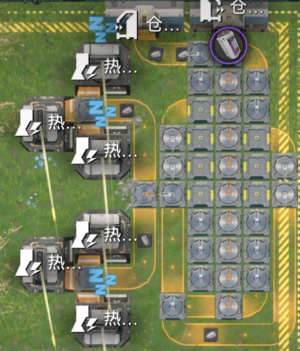

# 终末地电池分流最优解计算器

这是一个用于 **明日方舟终末地** 基建电池分流的最优解计算器。在给定电池功率值、持续时间、目标功率、电池输入速率与最大分流器数量约束下，输出可达到目标功率的最优分流结构。

[](https://endfield.nalulu.moe/battery/)

## 如何使用

具体摆放见计算结果中的连接方式，每个分流器有一个输入口和三个输出口，按结果指示进行连接。

### 示例

#### 输入参数

- 电池功率值：`1100`
- 持续时间：`40`
- 目标功率：`4800`
- 最大分流器数量：`10`
- 电池输入速率：`0.5`

#### 计算结果

```
结果
输入功率 P_in = 22000 (约 22000.000000)
目标功率 = 4800
最优分数 = 2863/13122 (分流器数量=9, 1/2=1, 1/3=8)
输出功率 = 31493000/6561 (约 4800.030483)

连接方式
分流器1: 分流器2 仓库 仓库
分流器2: 分流器3 输出 仓库
分流器3: 分流器4 输出 输出
分流器4: 分流器5 输出 输出
分流器5: 分流器6 输出 输出
分流器6: 分流器7 仓库 仓库
分流器7: 分流器8 仓库 仓库
分流器8: 分流器9 仓库 仓库
分流器9: 仓库 输出
```

#### 对应实际分流器结构如图



共九个分流器，八个一分三，一个一分二，通过物流桥和汇流器区分输出和送回仓库。电池由六个热能器消耗，多余的电池通过总线回到仓库。

## 原理简述

### 计算输入功率

首先计算电池的真实功率为：

```
P_in = 能量值 × 持续时间 × 电池输入速率
```

其中电池输入速率允许小数或分数（如 `0.5` 或 `1/2`），计算全程使用有理数与 `BigInt`，避免浮点误差。

### 分流器模型

在终末地的分流器体系中，每个分流器等价于将输入分成：

- `1/2`（二分）或
- `1/3`（三分）

因此任意分流结构的总输出比例可以表示为：

```
输出比例 = m / D
D = 2^a × 3^b
```

其中 `a` 为二分器数量，`b` 为三分器数量。

### 搜索最优比例

在 `a + b <= maxGates` 的约束下，遍历所有 `a, b` 组合，并对每个 `D` 计算满足目标功率的最小 `m`：

```
m = floor(target × D × q / p) + 1
```

- `p/q` 是 `P_in` 的最简分数
- 该公式确保 `P_out = P_in × (m/D) > target`

然后选择 **最小的 `m/D`**（若相同则优先使用更少的分流器）。

### 构造分流连接

根据最优的 `a` 和 `b`，按顺序构建分流器 DAG：

- 每个分流器产生若干“叶子”
- 叶子被标记为 `输出` 或 `仓库`
- 生成“分流器N: …”形式的连接方式输出

### 为什么是 DAG

- 传送带流向从输入到后续分流器或终点（热能池/仓库），不会回到上游，因此具有**有向性**。
- 每一步只向更细的分流推进，不存在“回流”或“环”，因此是**无环**。

## 项目结构

- `index.html`：页面与输入表单
- `styles.css`：UI 样式
- `app.js`：计算逻辑与交互处理
- `main.go`：原始 Go 版本实现（参考）

## 说明

- 建议 `maxGates` 保持较小（默认 10），确保浏览器计算流畅。
- 可通过预设快速填充功率值/持续时间参数。
